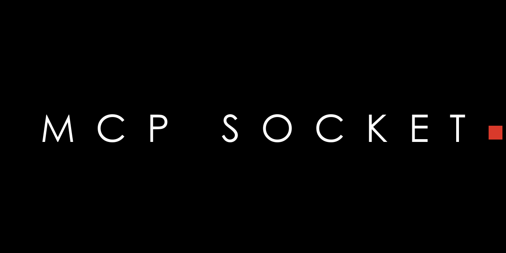

# MCP Socket



**Blender 4.2+ extension.** A lightweight local TCP bridge between Blender and
ZCode (or any `blender-mcp` 1.6.x-compatible client). Wire-compatible with the
`blender-mcp.exe` protocol — no MCP config changes needed on the client side.

*Документация на русском: [README.ru.md](README.ru.md)*

Author: **Maksim Kovalev** · License: GPL-3.0-or-later

> ⚠️ **Security note:** this add-on hosts a TCP server on `localhost` (port
> 9876 by default) whose `execute_code` command runs **arbitrary Python code
> in Blender** with no authentication. This matches the upstream blender-mcp
> design and is fine on a personal machine, but do not expose the port beyond
> `localhost` and don't run it on shared/untrusted hosts.

## Features

- TCP server on `localhost:9876` (blender-mcp default port)
- 9 core commands:
  - `get_telemetry_consent` — handshake (blender-mcp blocks without it)
  - `get_scene_info` / `get_object_info` — read the scene
  - `execute_code` — run arbitrary `bpy` code
  - `get_viewport_screenshot` — capture the 3D viewport
  - `get_polyhaven_status` / `get_hyper3d_status` / `get_sketchfab_status` /
    `get_hunyuan3d_status` — stubs answering `enabled: false`
    (blender-mcp drops the connection without them)
- **Bridge extension commands** (v1.3.0) — reachable from any client via its
  code-execution escape hatch:
  ```python
  from bl_ext.user_default.mcp_socket import handlers
  handlers.HANDLERS["get_console_log"](last_n=100)
  ```
  - `get_console_log` / `clear_console_log` — ring buffer (500 lines) of
    Python-level console output: addon prints, tracebacks, logging. C-level
    console (register warnings, operator reports) is not visible to Python.
  - `get_bridge_info` — one-call identity card: bridge/Blender versions, pid,
    scene, filepath, counts, actual port
  - `get_hierarchy` — collection tree with objects and visibility flags
  - `get_object_data` — full read-only object dossier (modifiers, constraints,
    material slots, mesh stats, custom props, action)
  - `get_material_info` — nodes summary, image textures with colorspace and
    on-disk state
  - `get_images_report` — all images: paths, colorspace, packed, missing files
  - `list_instances` — live bridge instances on this machine (multi-instance)
- **Pipeline I/O** (v2.2.0) — `export_fbx` (neutral FBX: meters, Y-up, binary,
  modifiers baked; presets maya/houdini/ue/neutral; per-call overrides echoed
  in the report), `import_fbx` (receiver rule: container EMPTY t=0 r=0 s=1,
  oversized meshes reported, never rescaled), `list_presets`
- **Offscreen render** (v2.4.0) — `render_offscreen`: mode `viewport` (fast
  OpenGL render of the current 3D view — no render window, no overlays/gizmos)
  or `camera` (full scene engine from the scene camera; Cycles can be slow).
  Render settings are saved and always restored, 5.2 `media_type` quirks
  handled
- **Multi-instance:** if the preferred port is busy, the bridge binds the next
  port (9877, 9878, …) and registers itself in
  `%TEMP%/mcp_socket_instances/pid_<pid>.json` (heartbeat every ~10 s) — a
  second Blender instance runs its own bridge side by side with the first
- **Undo Agent Work button** — the bridge drops an undo checkpoint before
  the first code command of each agent session (10 s idle gap), so one click
  rolls back everything the agent changed in that session (disable per
  preference on huge scenes)
- Auto-starts when the add-on is enabled
- N-panel in the 3D viewport: status badge (green/red dot), Test Connection,
  Last command, actual bound port
- 30 s idle-timeout against zombie connections
- Status icons are generated as PNGs in memory — no external files, no Pillow

## Connect from any MCP client

The repo ships a thin stdio MCP server (`mcp_server/server.py`, stdlib only)
that exposes every bridge handler as a native MCP tool:

```json
"mcp-socket": {
  "command": "python",
  "args": ["<repo>/mcp_server/server.py"]
}
```

Any MCP-compatible app can connect — the bridge is client-agnostic.
Multi-instance: launch a second entry with `--port 9877`.

## Installation (Blender 4.2+)

1. **Free the port.** Disable any other add-on that owns port 9876
   (e.g. the Blender Lab "MCP" extension or an old "Blender MCP" add-on),
   then restart Blender.
2. Download `mcp_socket.zip` from the [latest release](https://github.com/abyrvalg379/mcp-socket/releases/latest).
3. `Edit → Preferences → Get Extensions → ≡ (top right) → Install from Disk…`
   → pick the zip.
4. Enable **MCP Socket**. The bridge starts automatically.
5. Verify: `/mcp` in ZCode shows Blender as `connected` (green dot in panel).

## Preferences

- **Port** — TCP port of the bridge (default 9876)
- **Auto port offset for second instance** — if the port is busy, try the next
  10 ports instead of failing (on by default)
- **Undo checkpoint per agent session** — drop an undo checkpoint before the
  first code command after a 10 s idle gap (on by default)
- **Allow richer anonymous telemetry** — off by default; if on, the bridge
  answers `consent=true` to blender-mcp's telemetry check

## How it works

```
MCP Socket client (blender-mcp.exe protocol)
        │  JSON per request: {"type": "<command>", "params": {...}}
        ▼
TCP server (background thread, localhost:9876)
        │  bpy.app.timers → main thread (bpy is not thread-safe)
        ▼
handlers.py → {"status": "success", "result": ...} | {"status": "error", ...}
```

## Structure

```
mcp_socket/
├── blender_manifest.toml   extension metadata (Blender 4.2+)
├── __init__.py             register/unregister + auto-start + hot-reload guard
├── server.py               TCP 9876, port offset, threads, main-thread dispatch
├── handlers.py             command registry (core + bridge extensions)
├── queries.py              structured scene queries + instance registry
├── logcap.py               console ring buffer (Python-level stdout/stderr)
├── pipeline.py             FBX export/import per PROKLADKA rules + presets
├── render.py               offscreen render (viewport OpenGL / camera)
├── presets.py              export preset contracts (PROKLADKA)
├── ui.py                   N-panel + preferences + operators + refresh timer
├── icons.py                in-memory PNG status icons (green/red dot)
├── reload_addon.py         hot reload snippet
└── mcp_server/
    └── server.py           thin stdio MCP server (stdlib-only JSON-RPC)
```

## Changelog

- **2.4.0** — **offscreen render** (`render_offscreen`): mode `viewport` (fast
  OpenGL render of the current 3D view) or `camera` (full scene engine from
  the scene camera); output path/format from the file extension, resolution
  and percent overridable, render settings always restored (Blender 5.2
  `media_type` VIDEO quirk handled). Render sub-panel with an offscreen
  button; 16th native MCP tool
- **2.3.0** — **phase 2: own MCP server** (`mcp_server/server.py`, stdlib-only
  hand-rolled JSON-RPC over stdio, same pattern as the Maya bridge): every
  bridge handler becomes a native MCP tool for any client — typed params, no
  code-writing. Registered as a second config entry next to blender-mcp.
- **2.2.0** — pipeline I/O per PROKLADKA rules: `export_fbx` (neutral FBX,
  meters, Y-up, presets maya/houdini/ue/neutral, per-call overrides echoed in
  the report), `import_fbx` (receiver rule: container EMPTY t=0 r=0 s=1,
  oversized meshes reported), `list_presets`; Pipeline sub-panel with
  Export/Import buttons; panel header reads **MCP Socket X.Y.Z** (dropped the
  redundant word "Bridge")
    - **2.1.0** — **Undo Agent Work** button: the bridge drops an undo checkpoint
  before the first code command of each agent session (a 10 s idle gap), so one
  click rolls back everything the agent changed in that session
    - **2.0.0** — renamed to **MCP Socket**: the bridge was never ZCode-specific —
  any `blender-mcp` 1.6.x-compatible client works. Module id `mcp_socket`,
  panel **MCP Socket**. Uninstall the old "ZCode MCP" extension before
  installing this one; port and protocol unchanged.

- **1.3.0** — bridge extension commands (`get_console_log`, `get_bridge_info`,
  `get_hierarchy`, `get_object_data`, `get_material_info`, `get_images_report`,
  `list_instances`), console ring buffer, multi-instance support (port offset +
  instance registry with heartbeat), live port in the panel
- **1.2.2** — round status icons restored: `bpy.utils.previews` is a lazy
  submodule, the missing explicit import was the root cause
- **1.2.1** — manifest fix for Blender 5.2.2 (flat `website` string)
- **1.2.0** — extension-only build (manifest is the single source of metadata,
  legacy `bl_info` removed)
- **1.1.0** — status icons, integration status stubs (4 integrations),
  idle-timeout 30 s, Test Connection, Last command, refresh timer
- **1.0.0** — initial release: 5 core commands, TCP server, Start/Stop panel
